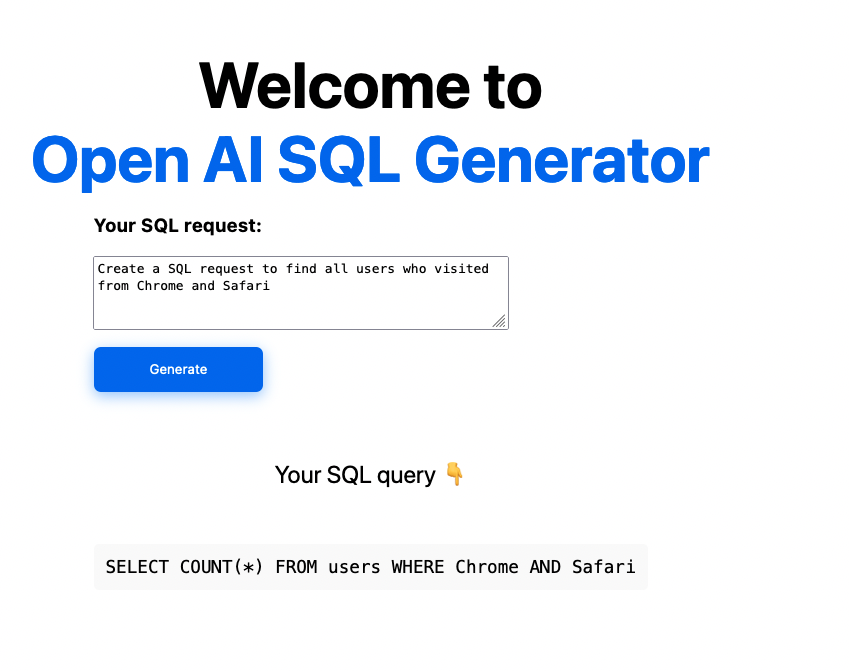

This is Open AI SQL generator example using Nextjs.



### Usage

- Create your Open AI account Get your API Key from [here.](https://beta.openai.com/)

- Clone this repository

```bash
git clone https://github.com/raufsamestone/open-ai-sql
```

- Create `.env` file

```bash
touch env.local
```

- Paste your API key

```env
OPENAI_API_KEY=<yourAPIKEY>
```

- Generate your SQL request! 🎉


